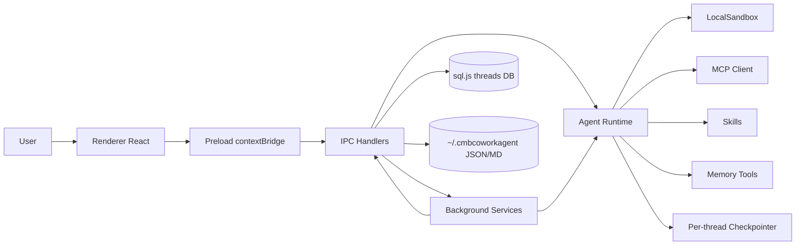

# CMBDevClaw

基于 `Electron + React + TypeScript + DeepAgents/LangChain` 的本地 AI Agent 桌面应用，面向工程研发场景，提供对话式协作、工作区读写、命令执行、技能系统、MCP 扩展、定时任务、心跳巡检与远端机器人联动能力。


> [!CAUTION]
> 应用可执行本地命令并读写工作区文件。请仅在可信项目目录中使用，并在高风险命令前进行审批确认。

## 核心功能

| 模块 | 能力 |
| --- | --- |
| 多线程对话 | 线程创建/切换/重命名/删除，首条消息自动生成标题，流式输出 |
| 工作区管理 | 绑定线程工作目录、文件树浏览、代码/图片/PDF 预览、Git Worktree 创建与提交 |
| Agent 执行 | 基于 DeepAgents + LangChain 的工具调用，支持文件操作、命令执行、子代理、浏览器工具 |
| 安全执行 | 命令安全分级（safe/needs_approval/forbidden）、审批缓存、永久规则、沙箱模式 |
| 技能系统 | 内置与自定义技能加载、启停、上传（`.md/.zip`）、删除；在线技能提案与确认 |
| MCP 扩展 | MCP 连接器管理、连通性测试、懒加载工具检索 |
| 插件系统 | 插件安装（ZIP/目录）、启停、卸载；插件内 `skills` 与 `.mcp.json` 自动注册 |
| 自优化 | Trace 收集与回放、候选技能生成、审批后写回技能目录 |
| 定时任务 | 按频率自动触发 Agent 执行（once/manual/hourly/daily/weekdays/weekly/interval） |
| Heartbeat | 固定线程心跳巡检、`HEARTBEAT.md` 驱动、静默 ACK 过滤与通知 |
| Memory | 本地记忆文件管理、索引检索、启停控制 |
| ChatX 机器人 | WebSocket 收消息、Agent 处理、HTTP 回传结果，支持多机器人并发配置 |
| 可视化视图 | Thread 视图、Kanban 视图、自定义中心（技能/MCP/插件/沙箱/自优化等） |

## 技术架构

### 分层设计

1. **Renderer（React）**
   - 负责 UI、交互与状态管理（`zustand` + Thread Context）
   - 通过 `window.api` 访问主进程能力

2. **Preload（contextBridge）**
   - 对 IPC 通道做统一封装
   - 按业务域暴露 API：`agent / threads / models / workspace / skills / mcp / sandbox / optimizer ...`

3. **Main（Electron）**
   - IPC 路由层：`src/main/ipc/*`
   - Agent Runtime：`src/main/agent/runtime.ts`
   - 服务层：`scheduler / heartbeat / chatx / workspace-watcher / notify`
   - 持久化层：`sql.js + 文件存储（~/.cmbcoworkagent）`

### 运行链路



## 关键模块说明

| 路径 | 说明 |
| --- | --- |
| `src/main/index.ts` | Electron 主进程入口，窗口生命周期、IPC 注册、后台服务启动 |
| `src/preload/index.ts` | 渲染进程 API 桥接 |
| `src/main/agent/runtime.ts` | Agent 组装：模型、工具、技能、MCP、记忆、checkpointer、沙箱 |
| `src/main/agent/local-sandbox.ts` | 文件与命令执行后端、Windows 沙箱适配、Hook 执行 |
| `src/main/agent/tool-orchestrator.ts` | 审批编排与执行策略（命令/文件写入审批） |
| `src/main/agent/exec-policy.ts` | 命令安全策略引擎（危险命令识别） |
| `src/main/ipc/*.ts` | 各业务域 IPC：线程、模型、工作区、技能、MCP、插件、任务、心跳、沙箱、优化等 |
| `src/main/services/*.ts` | 定时调度、心跳、ChatX、通知、标题生成等服务 |
| `src/main/storage.ts` | 本地配置与业务数据文件读写 |
| `src/main/db/index.ts` | sql.js 线程元数据存储 |
| `src/renderer/src/App.tsx` | 顶层布局（Thread / Kanban / Customize） |
| `src/renderer/src/components/customize/*` | 自定义中心各能力面板 |

## 数据存储

应用主数据目录：`~/.cmbcoworkagent`

- `cmbcoworkagent.sqlite`：线程元数据数据库（sql.js）
- `threads/*.sqlite`：按线程的 LangGraph checkpoint
- `custom-models.json`：模型配置
- `mcp-connectors.json`：MCP 连接器
- `plugins.json` + `plugins/`：插件元数据与内容
- `scheduled-tasks.json` + `task-runs.json`：定时任务配置与执行记录
- `heartbeat-config.json` + `HEARTBEAT.md`：心跳配置与内容
- `chatx-config.json`：机器人配置
- `sandbox-settings.json` + `approval-rules.json`：沙箱模式与审批规则
- `memory/`：记忆文件与索引

## 项目结构

```text
src/
  main/               # Electron 主进程、IPC、Agent Runtime、服务、存储
  preload/            # contextBridge API 暴露
  renderer/           # React 前端
    src/components/   # chat/sidebar/panels/customize/kanban/tabs/ui
skills/               # 内置技能
resources/            # 平台资源与二进制
tests/                # 测试用例（当前示例：diff panel）
```

## 快速开始

### 环境要求

- Node.js `>=18 <24`
- Windows 环境必须使用 Node.js `20.x`
- npm `>=10`

### 本地开发

```bash
npm install
npm run dev
```

### 打包构建

```bash
npm run build
npm run dist
```

## 常用脚本

| 命令 | 说明 |
| --- | --- |
| `npm run dev` | 启动开发环境（electron-vite） |
| `npm run build` | 构建 main/preload/renderer |
| `npm run dist` | 构建并使用 electron-builder 打包 |
| `npm run lint` | ESLint 检查 |
| `npm run typecheck` | TS 类型检查（node + web） |
| `npm run format` | Prettier 格式化 |

## 环境变量

`.env` 示例（按需配置）：

| 变量 | 说明 |
| --- | --- |
| `VITE_API_BASE_URL` | 后端 API 基地址（市场、版本、上报等） |
| `VITE_RENDER_URL` | 可选：渲染进程远端地址 |
| `VITE_CHATX_WS_URL` | ChatX WebSocket 地址 |
| `VITE_CHATX_HTTP_URL` | ChatX HTTP 回调地址 |
| `VITE_CHATX_CHANNEL` | ChatX channel |
| `VITE_CHATX_CALLBACK_URL` | 机器人平台回调地址基址 |
| `VITE_LOGIN_PT` | 登录环境标识 |
| `VITE_INTRUCTION_URL` | 使用说明地址（前端展示） |
| `VITE_APP_DOWNLOAD_URL` | 应用下载地址（前端展示） |
| `VITE_MARKET_MOCK_ON_ERROR` | 市场请求失败时是否启用 mock 回退 |

## 安全建议

1. 默认保持沙箱模式开启，非必要不要切换到 `none`。
2. 对 `git push --force`、删除类命令、脚本下载执行类命令保持人工审批。
3. 工作区建议使用独立目录，避免将敏感目录直接暴露给 Agent。
4. 定时任务与远端机器人建议最小权限配置（模型、目录、连接器按需开通）。

## License

MIT，详见 [LICENSE](LICENSE)。
